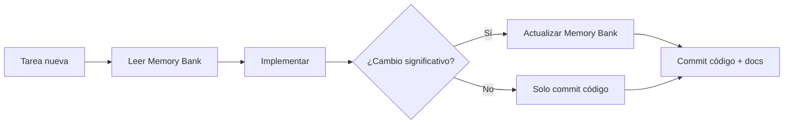

# Memory Bank - LTI Talent Tracking System

## 🎯 Propósito

Este **Memory Bank** es el sistema de documentación persistente del proyecto LTI. Está diseñado para que **cualquier agente AI o desarrollador humano** pueda retomar el proyecto sin contexto previo.

## 📁 Estructura

```
memory-bank/
│
├── README.md                     ← Estás aquí
│
├── 📋 CORE FILES (leer siempre)
│   ├── projectbrief.md          → Qué es, alcance, stakeholders
│   ├── productContext.md         → Por qué existe, cómo funciona
│   ├── systemPatterns.md         → Arquitectura y patrones
│   ├── techContext.md            → Stack tecnológico, setup
│   ├── activeContext.md          → Estado actual, next steps
│   └── progress.md               → Qué funciona, qué falta
│
├── 🏗️ architecture/
│   ├── overview.md               → Visión arquitectónica detallada
│   └── diagrams.md               → Diagramas (Mermaid)
│
├── 🧠 domains/
│   ├── domain-model.md           → Modelo DDD, agregados, entidades
│   └── key-flows.md              → Flujos de negocio principales
│
├── 🔌 interfaces/
│   └── api.md                    → Contratos API REST
│
├── ⚙️ ops/
│   ├── local-dev.md              → Guía desarrollo local
│   └── deployment.md             → Deployment (no implementado)
│
├── ✅ quality/
│   ├── testing.md                → Estrategia de testing
│   └── linting-format.md         → Code quality
│
└── 📝 decisions/
    └── ADR-*.md                  → Architecture Decision Records
```

## 🚀 Quick Start para Agentes AI

### Primera vez en el proyecto
```
1. Leer en orden:
   - projectbrief.md (5 min)
   - productContext.md (10 min)
   - systemPatterns.md (15 min)
   - techContext.md (10 min)
   - activeContext.md (5 min)
   - progress.md (10 min)

2. Identificar tarea en activeContext.md → "Next steps"

3. Consultar referencias según necesidad:
   - architecture/ → Dudas de diseño
   - domains/ → Lógica de negocio
   - interfaces/ → Contratos API
```

### Continuación de sesión previa (mismo contexto)
```
1. Leer solo:
   - activeContext.md (estado actual)
   - progress.md (qué cambió)

2. Continuar con tarea
```

## 📖 Guía de uso por rol

### 🤖 Agente AI (Cursor, Claude, etc.)
1. **Obligatorio**: Leer archivos core antes de cada tarea
2. Seguir reglas en `.cursor/rules/memory-bank.mdc`
3. Actualizar Memory Bank al completar tareas significativas

### 👨‍💻 Desarrollador humano
1. Leer core files al unirte al proyecto
2. Consultar como referencia durante desarrollo
3. Actualizar cuando hagas cambios arquitectónicos

### 👔 Product Owner / Instructor
1. `projectbrief.md` y `productContext.md` → Visión de producto
2. `progress.md` → Estado actual y roadmap
3. `activeContext.md` → Próximos pasos

### 🏗️ Arquitecto
1. `architecture/overview.md` → Visión completa
2. `systemPatterns.md` → Patrones aplicados
3. `decisions/` → ADRs de decisiones tomadas

## 🔄 Workflow de actualización



### ¿Cuándo actualizar?

**✅ SÍ actualizar cuando**:
- Implementas nueva feature importante
- Cambias arquitectura
- Añades/modificas endpoints
- Resuelves deuda técnica
- Descubres información incorrecta

**❌ NO actualizar para**:
- Fix de typos
- Cambios de formato
- Refactor interno sin cambio de comportamiento
- Updates de dependencias (a menos que cambien comportamiento)

## 📊 Métricas de completitud

### Documentación actual (2026-01-19)

| Área | Completitud | Archivos |
|------|-------------|----------|
| Core files | ✅ 100% | 6/6 |
| Architecture | ✅ 100% | 2/2 |
| Domains | ✅ 100% | 2/2 |
| Interfaces | ⚠️ 80% | 1/2 (falta events-jobs.md) |
| Ops | ⚠️ 60% | 2/3 (falta observability.md) |
| Quality | ✅ 100% | 2/2 |
| Decisions | ⚠️ Template | 1/N (solo template) |
| Cursor Rules | ✅ 100% | 2/2 |

**Total**: 18 archivos documentados

## 🎓 Principios del Memory Bank

### 1. **Verdad en el código**
Si hay contradicción entre Memory Bank y código, **el código es la verdad**. Actualiza la documentación.

### 2. **No inventar**
Solo documenta lo que puedes verificar. Usa `UNKNOWN` o `⚠️` para incertidumbres.

### 3. **Operacional, no narrativo**
Incluye comandos ejecutables, rutas exactas, ejemplos concretos. No "probablemente", sí "archivo X línea Y".

### 4. **Evolutivo**
Este es un documento vivo. Actualízalo frecuentemente. Añade fechas a cambios importantes.

### 5. **Context-free**
Cualquier persona sin contexto previo debe poder leer el Memory Bank y entender el proyecto completo.

## 🛠️ Herramientas útiles

### Visualizar diagramas Mermaid
- GitHub renderiza automáticamente
- VSCode: Extension "Markdown Preview Mermaid Support"
- Online: https://mermaid.live/

### Buscar en Memory Bank
```bash
# Desde raíz del proyecto
grep -r "término" memory-bank/

# Buscar TODO pendientes
grep -r "UNKNOWN" memory-bank/
```

### Validar enlaces internos
```bash
# Desde memory-bank/
find . -name "*.md" -exec grep -H "Ver.*\.md" {} \;
```

## 🔗 Enlaces rápidos

### Documentación del proyecto (fuera de Memory Bank)
- [README principal](../README.md) - Setup e instrucciones
- [Buenas Prácticas](../backend/ManifestoBuenasPracticas.md) - Guía DDD y SOLID
- [Modelo de Datos](../backend/ModeloDatos.md) - ERD y descripciones
- [API Spec](../backend/api-spec.yaml) - OpenAPI 3.0

### Dentro del Memory Bank
- [Setup local](ops/local-dev.md) - Quick start
- [API Reference](interfaces/api.md) - Endpoints
- [Testing](quality/testing.md) - Cómo ejecutar tests
- [Arquitectura](architecture/overview.md) - Visión completa

## 📞 Contacto y contribución

### Para agentes AI
- Sigue reglas en `.cursor/rules/memory-bank.mdc`
- Actualiza `activeContext.md` después de cada sesión importante

### Para humanos
- Ver README principal del proyecto
- Instructor: (según README del proyecto)

## 🔄 Historial de cambios del Memory Bank

| Fecha | Cambio | Autor |
|-------|--------|-------|
| 2026-01-19 | Creación inicial del Memory Bank completo | Cursor AI Agent |
| - | Próxima actualización pendiente | - |

---

## ⚠️ Nota importante

**Este Memory Bank fue creado por un agente AI analizando el código fuente**. Aunque se ha hecho con máxima precisión, pueden existir:

- ✅ **Información verificada en código**: Confianza ALTA
- ⚠️ **Inferencias lógicas**: Confianza MEDIA (marcadas con ⚠️)
- ❓ **Incertidumbres**: Marcadas como `UNKNOWN` (requieren validación humana)

**Acción recomendada**: Revisar sección "Preguntas al humano" en archivos core para validar suposiciones.

---

**Versión del Memory Bank**: 1.0.0  
**Fecha de creación**: 2026-01-19  
**Próxima revisión sugerida**: Después de implementar primeros 5 items de prioridad alta

**¿Dudas?** Consulta `.cursor/rules/memory-bank.mdc` para workflow detallado
