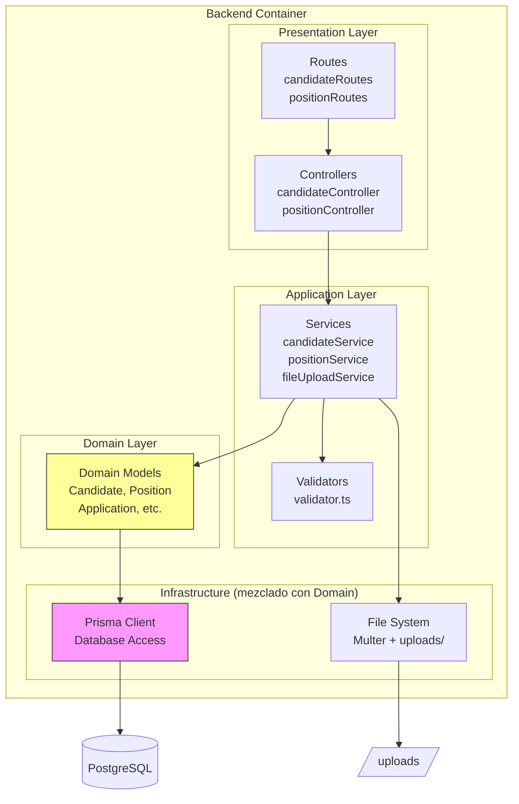
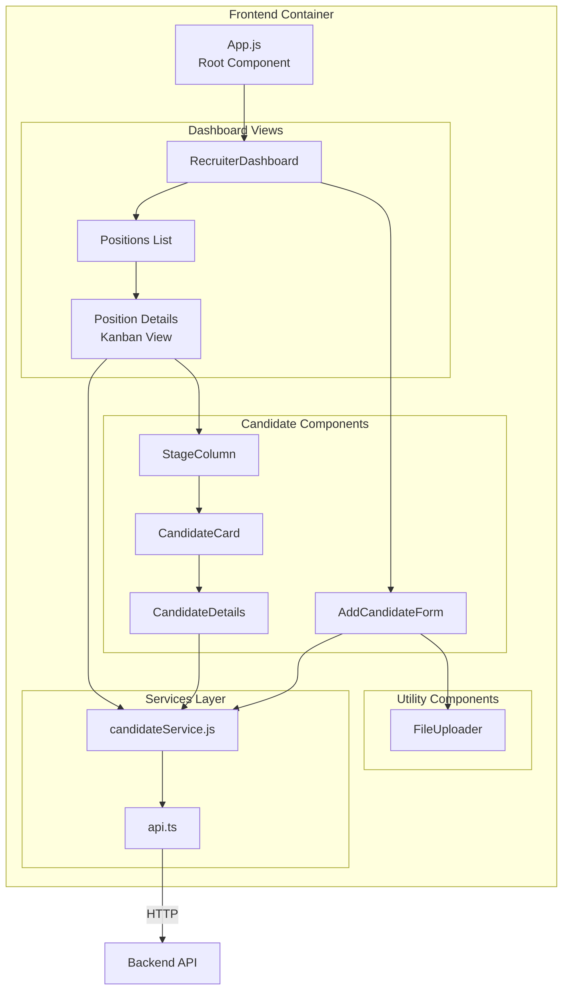
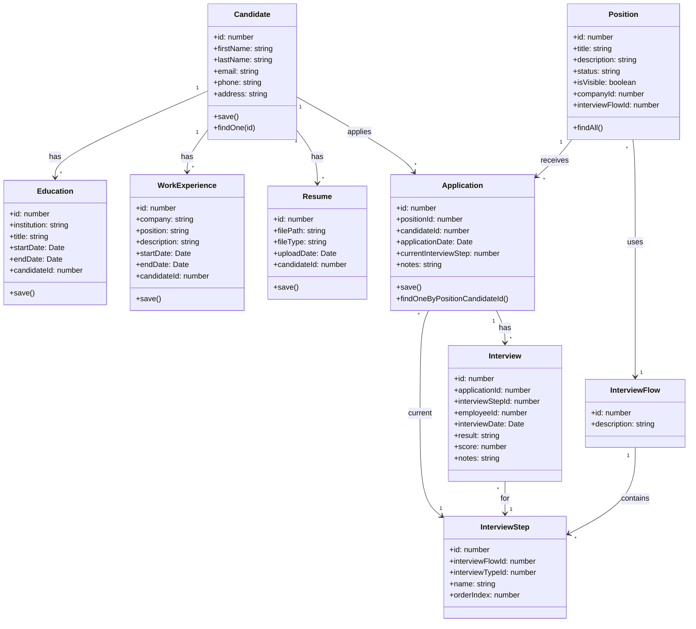
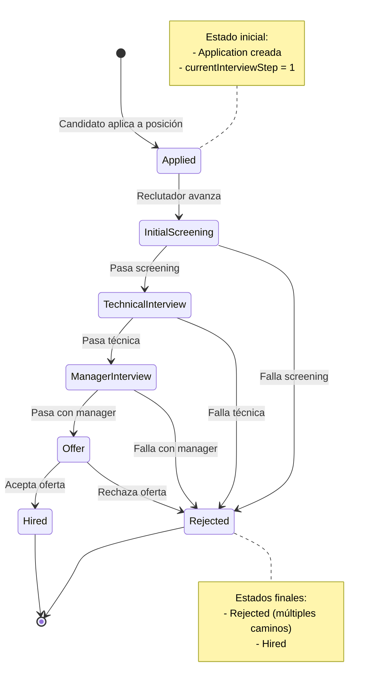
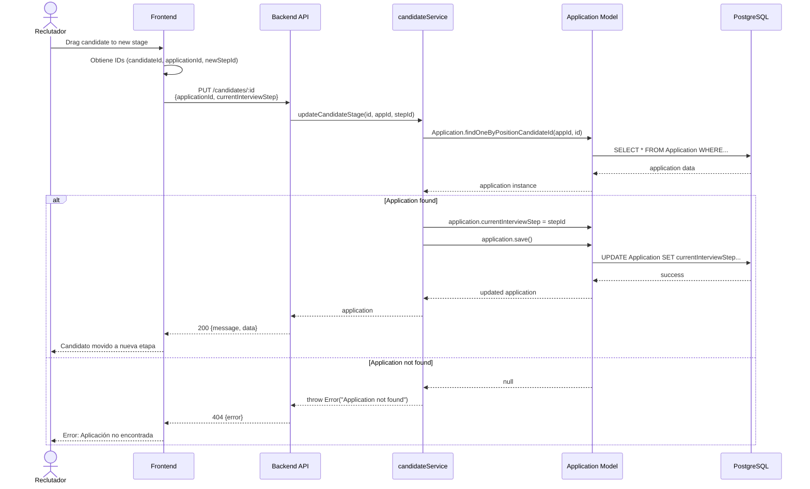
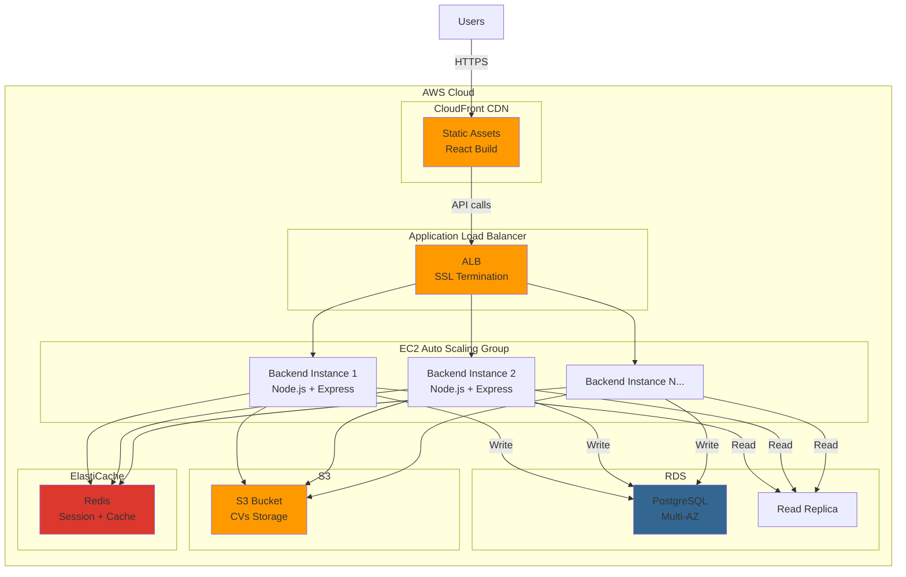
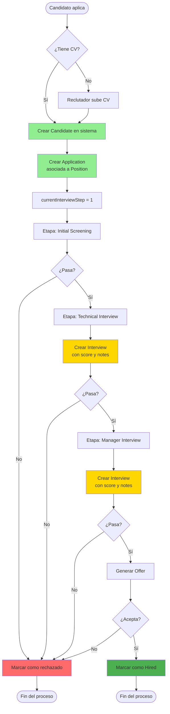

# Architecture Diagrams - LTI Talent Tracking System

## Diagrama C4 - Nivel 1: Contexto del Sistema

```mermaid
C4Context
    title Diagrama de Contexto - LTI Talent Tracking System
    
    Person(recruiter, "Reclutador", "Gestiona candidatos y procesos de selección")
    Person(interviewer, "Entrevistador", "Evalúa candidatos en diferentes etapas")
    Person(candidate, "Candidato", "Aplica a posiciones (futuro: portal)")
    
    System(lti, "LTI System", "Sistema de seguimiento de talento y gestión de procesos de reclutamiento")
    
    System_Ext(email, "Sistema de Email", "Gmail, Outlook (futuro)")
    System_Ext(storage, "Cloud Storage", "AWS S3 (futuro)")
    System_Ext(linkedin, "LinkedIn API", "Importar perfiles (futuro)")
    
    Rel(recruiter, lti, "Gestiona candidatos y posiciones", "HTTPS")
    Rel(interviewer, lti, "Evalúa candidatos", "HTTPS")
    Rel(candidate, lti, "Aplica a posiciones (futuro)", "HTTPS")
    
    Rel_Neighbor(lti, email, "Envía notificaciones (futuro)", "SMTP")
    Rel(lti, storage, "Almacena CVs (futuro)", "S3 API")
    Rel(lti, linkedin, "Importa perfiles (futuro)", "REST")
    
    UpdateRelStyle(lti, email, $offsetY="-40", $offsetX="-90")
    UpdateRelStyle(lti, storage, $offsetY="-10")
    UpdateRelStyle(lti, linkedin, $offsetY="20")
```

## Diagrama C4 - Nivel 2: Contenedores (ya incluido en overview.md)

Ver `architecture/overview.md` para diagrama de contenedores completo.

## Diagrama de componentes - Backend



## Diagrama de componentes - Frontend



## Modelo de dominio (DDD)



## Diagrama de estados - Candidato en proceso



## Diagrama de secuencia - Actualizar etapa de candidato



## Diagrama de deployment (actual)

```mermaid
graph TB
    subgraph "Developer Machine"
        subgraph "Frontend Dev"
            ReactDev[React Dev Server<br/>localhost:3000]
        end
        
        subgraph "Backend Dev"
            ExpressDev[Express Server<br/>localhost:3010<br/>ts-node-dev]
        end
        
        subgraph "Docker"
            Postgres[PostgreSQL<br/>localhost:5432]
        end
        
        subgraph "File System"
            Uploads[/uploads<br/>CVs storage]
        end
    end
    
    ReactDev -->|HTTP| ExpressDev
    ExpressDev -->|Prisma| Postgres
    ExpressDev -->|Multer| Uploads
    
    style ReactDev fill:#61dafb
    style ExpressDev fill:#90c53f
    style Postgres fill:#336791
```

## Diagrama de deployment (propuesto para producción)



## Diagrama de base de datos (simplificado)

Ver `backend/ModeloDatos.md` para diagrama ERD completo.

Resumen de relaciones clave:

```
Candidate (1) ──< (N) Education
Candidate (1) ──< (N) WorkExperience
Candidate (1) ──< (N) Resume
Candidate (1) ──< (N) Application

Position (1) ──< (N) Application
Position (N) ──> (1) InterviewFlow
Position (N) ──> (1) Company

InterviewFlow (1) ──< (N) InterviewStep

Application (N) ──> (1) InterviewStep [current]
Application (1) ──< (N) Interview

Interview (N) ──> (1) InterviewStep
Interview (N) ──> (1) Employee

Company (1) ──< (N) Employee
```

## Diagrama de flujo - Proceso completo de reclutamiento



---

**Nota sobre diagramas**: Los diagramas usan sintaxis Mermaid. Para visualizarlos:
1. GitHub los renderiza automáticamente en Markdown
2. VSCode con extensión "Markdown Preview Mermaid Support"
3. [Mermaid Live Editor](https://mermaid.live/)

**Limitación**: Algunos diagramas C4 pueden no renderizarse correctamente en todas las herramientas. Para diagramas C4 completos, considerar usar [Structurizr](https://structurizr.com/) o [PlantUML](https://plantuml.com/).
