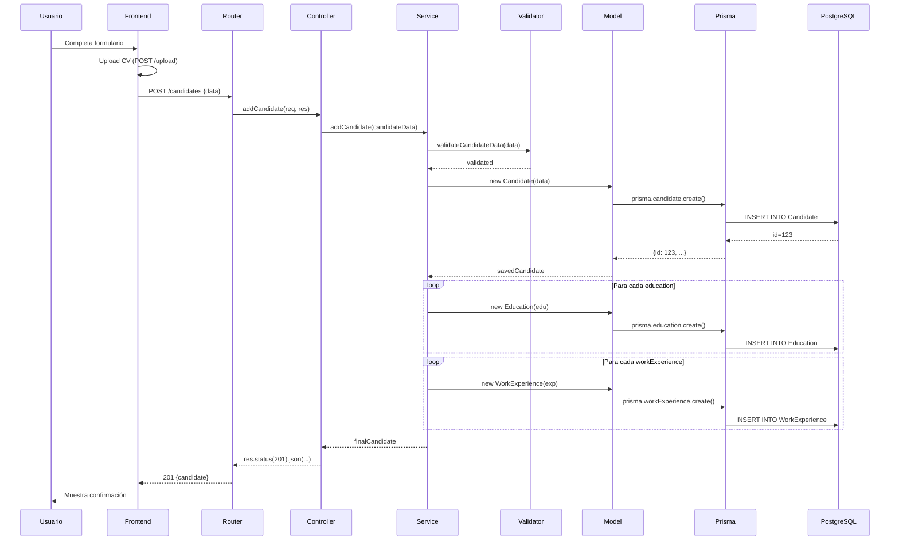
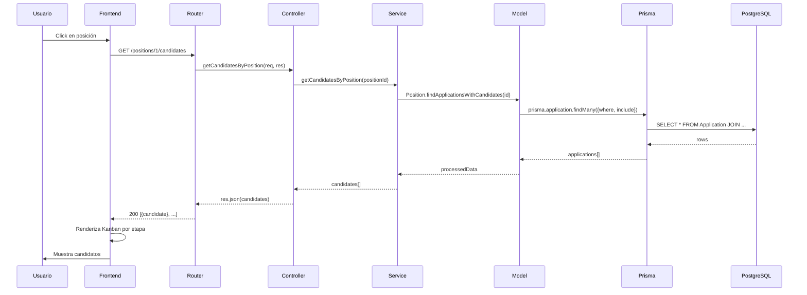

# Architecture Overview - LTI Talent Tracking System

## Visión general de la arquitectura

### Estilo arquitectónico
**Layered Architecture** con elementos de **Domain-Driven Design (DDD)**

```
┌─────────────────────────────────────────────────────────┐
│                    Frontend SPA                          │
│              (React + TypeScript)                        │
│  ┌──────────────────────────────────────────────────┐  │
│  │  Components (UI) → Services → API Config         │  │
│  └──────────────────────────────────────────────────┘  │
└─────────────────────────────────────────────────────────┘
                           │ HTTP/REST
                           ↓
┌─────────────────────────────────────────────────────────┐
│                    Backend API                           │
│         (Node.js + Express + TypeScript)                 │
│  ┌──────────────────────────────────────────────────┐  │
│  │ Presentation Layer (Controllers + Routes)        │  │
│  │           ↓                                      │  │
│  │ Application Layer (Services + Validators)       │  │
│  │           ↓                                      │  │
│  │ Domain Layer (Models + Business Logic)          │  │
│  │           ↓                                      │  │
│  │ Infrastructure Layer (Prisma - PARCIAL)         │  │
│  └──────────────────────────────────────────────────┘  │
└─────────────────────────────────────────────────────────┘
                           │ Prisma ORM
                           ↓
┌─────────────────────────────────────────────────────────┐
│                PostgreSQL Database                       │
│              (Docker containerizado)                     │
└─────────────────────────────────────────────────────────┘

┌─────────────────────────────────────────────────────────┐
│               Local File System                          │
│              /uploads (CVs)                              │
└─────────────────────────────────────────────────────────┘
```

## Principios de diseño aplicados

### 1. Separation of Concerns
- **Frontend**: UI/UX y presentación
- **Backend**: Lógica de negocio y orquestación
- **BD**: Persistencia y relaciones

### 2. Layered Architecture (Backend)

**Presentation Layer** (`src/presentation/`)
- **Responsabilidad**: Recibir requests HTTP, validar formato, delegar a Application Layer
- **Componentes**: Controllers
- **Regla**: NO debe contener lógica de negocio
- **Dependencias**: Depende de Application Layer

**Application Layer** (`src/application/`)
- **Responsabilidad**: Orquestación de casos de uso, validación de negocio
- **Componentes**: Services, Validators
- **Regla**: Coordina operaciones del dominio, NO implementa lógica de negocio compleja
- **Dependencias**: Depende de Domain Layer

**Domain Layer** (`src/domain/`)
- **Responsabilidad**: Lógica de negocio pura, modelos de dominio
- **Componentes**: Entities (models)
- **Regla**: Independiente de frameworks (DEBERÍA, pero actualmente depende de Prisma)
- **Dependencias**: NO debería depender de nada externo

**Infrastructure Layer** (PARCIALMENTE IMPLEMENTADO)
- **Responsabilidad**: Acceso a BD, file system, servicios externos
- **Componentes**: Repositories (NO implementados), Prisma client
- **Regla**: Detalles de implementación, fácilmente reemplazables
- **Dependencias**: Depende de librerías externas (Prisma, file system, etc.)

⚠️ **PROBLEMA ACTUAL**: Infrastructure Layer no está separada. Los modelos de dominio llaman directamente a Prisma, violando Dependency Inversion Principle.

### 3. Domain-Driven Design (DDD)

**Agregados identificados**:
- **Candidate** (aggregate root) → Education, WorkExperience, Resume
- **Position** (aggregate root) → Applications
- **InterviewFlow** (aggregate root) → InterviewSteps
- **Application** (aggregate root) → Interviews

**Value Objects potenciales** (actualmente implementados como entities):
- Education (podría ser value object de Candidate)
- WorkExperience (podría ser value object de Candidate)
- Resume (podría ser value object de Candidate)

**Services de dominio**:
- candidateService: Gestión de candidatos
- positionService: Gestión de posiciones

### 4. RESTful API
- Endpoints siguiendo convenciones REST
- Recursos: `/candidates`, `/positions`, `/upload`
- Verbos HTTP semánticos: GET, POST, PUT
- Status codes apropiados: 200, 201, 400, 404, 500

## Componentes principales

### Backend Components

#### 1. Express Application (index.ts)
**Propósito**: Configuración y arranque del servidor

**Responsabilidades**:
- Setup de middleware (CORS, JSON parser, Prisma injection)
- Registro de rutas
- Manejo de errores global
- Inicio del servidor HTTP

#### 2. Routes (src/routes/)
**Propósito**: Definición de endpoints y mapeo a controllers

**Archivos**:
- `candidateRoutes.ts`: POST, GET, PUT para candidatos
- `positionRoutes.ts`: GET para posiciones y candidatos por posición

#### 3. Controllers (src/presentation/controllers/)
**Propósito**: Adaptadores entre HTTP y Application Layer

**Patrón**: 
```typescript
async function controller(req: Request, res: Response) {
  try {
    const result = await service.method(req.body);
    res.status(200).json(result);
  } catch (error) {
    res.status(400).json({message: error.message});
  }
}
```

#### 4. Services (src/application/services/)
**Propósito**: Casos de uso y orquestación

**Ejemplo de flujo**:
```
addCandidate()
  → validateCandidateData()
  → new Candidate(data)
  → candidate.save()
  → for each education: new Education(), save()
  → for each workExperience: new WorkExperience(), save()
  → for each resume: new Resume(), save()
  → return savedCandidate
```

#### 5. Models (src/domain/models/)
**Propósito**: Entidades de dominio con lógica de negocio

**Patrón Active Record** (anti-pattern en DDD puro):
```typescript
class Entity {
  properties...
  
  async save() { /* Prisma call */ }
  static async findOne() { /* Prisma call */ }
}
```

#### 6. Validators (src/application/)
**Propósito**: Validación de inputs antes de procesar

**Implementación**: Funciones con regex para validar formato

#### 7. File Upload Service (src/application/services/)
**Propósito**: Gestión de uploads con Multer

**Configuración**:
- Storage: Local filesystem en `uploads/`
- Filtro: Solo PDF y DOCX
- Naming: Timestamp + nombre original

### Frontend Components

#### 1. App.js (root)
**Propósito**: Componente raíz, routing principal

#### 2. Dashboard Components
- **RecruiterDashboard**: Vista principal
- **Positions**: Lista de posiciones
- **PositionDetails**: Vista detalle con Kanban

#### 3. Candidate Components
- **AddCandidateForm**: Formulario de alta
- **CandidateCard**: Vista resumida en Kanban
- **CandidateDetails**: Vista detallada completa
- **StageColumn**: Columna del Kanban

#### 4. Utility Components
- **FileUploader**: Upload de CVs

#### 5. Services Layer (src/services/)
**Propósito**: Abstracción de llamadas a API

**Ejemplo**:
```javascript
export const addCandidate = async (candidateData) => {
  const response = await fetch(`${API_URL}/candidates`, {
    method: 'POST',
    headers: {'Content-Type': 'application/json'},
    body: JSON.stringify(candidateData)
  });
  return response.json();
};
```

## Flujos de datos principales

### Flujo 1: Crear candidato



### Flujo 2: Ver candidatos de posición



## Decisiones de arquitectura

### ¿Por qué Express en lugar de NestJS/Fastify?
- **Pros Express**: Simplicidad, flexibilidad, gran ecosistema
- **Contras**: Menos estructura opinionated, más código boilerplate
- **Decisión**: Apropiado para proyecto educativo, fácil de entender

### ¿Por qué Prisma en lugar de TypeORM/Sequelize?
- **Pros Prisma**: Type-safe, migraciones automáticas, Prisma Studio
- **Contras**: Menos maduro, lock-in
- **Decisión**: Mejor DX (Developer Experience) para TypeScript

### ¿Por qué React en lugar de Vue/Svelte?
- **Pros React**: Más popular, más recursos, gran ecosistema
- **Contras**: Más verbose, necesita más setup
- **Decisión**: Habilidad transferible, mercado laboral

### ¿Por qué NO hay autenticación?
- **Contexto**: Proyecto educativo en fase inicial
- **Riesgo**: NO apto para producción sin autenticación
- **Próximo paso**: Implementar JWT o Auth0

### ¿Por qué local file storage?
- **Pros**: Simple, sin dependencias externas
- **Contras**: No escalable, no distribuido
- **Alternativa**: AWS S3, Azure Blob Storage
- **Decisión**: Suficiente para MVP educativo

## Patrones de integración

### API Gateway (NO implementado)
- Frontend llama directamente a endpoints de backend
- Sin capa BFF (Backend For Frontend)
- Múltiples requests para vistas compuestas

### Comunicación síncrona
- Todos los endpoints son síncronos (request-response)
- No hay procesamiento asíncrono (jobs, queues)
- Limite: Operaciones largas bloquean el thread

### Sin event-driven architecture
- No hay eventos de dominio
- No hay pub/sub
- Cambios de estado no disparan notificaciones

## Escalabilidad y limitaciones

### Limitaciones actuales

1. **Stateful backend**: PrismaClient es singleton
   - No horizontal scaling directo
   - Connection pooling limitado

2. **File storage local**: No compartido entre instancias
   - Requiere shared storage (NFS, S3) para multi-instance

3. **Sin caching**: Todas las queries van a BD
   - No Redis, no in-memory cache
   - Queries repetidas son costosas

4. **Sin rate limiting**: Vulnerable a abuso
   - No hay throttling
   - No protección contra DDoS

5. **Sin queue system**: Procesamiento síncrono
   - Operaciones largas bloquean
   - No retry logic

### Cómo escalar (recomendaciones)

#### Escalar horizontalmente backend
1. Añadir load balancer (nginx, AWS ALB)
2. Múltiples instancias de backend
3. Shared file storage (S3)
4. Session storage externo si se añade auth (Redis)

#### Escalar base de datos
1. Read replicas para queries
2. Connection pooling (PgBouncer)
3. Particionamiento de tablas grandes

#### Optimizar frontend
1. CDN para assets estáticos
2. Code splitting (lazy loading)
3. Service worker para caching

## Seguridad en arquitectura

### Capas de seguridad (actual vs ideal)

| Capa | Actual | Ideal |
|------|--------|-------|
| Network | CORS básico | WAF, DDoS protection |
| Authentication | ❌ Ninguna | JWT, OAuth2 |
| Authorization | ❌ Ninguna | RBAC, policies |
| Data validation | ✅ Validator | ✅ + Schema validation |
| Data encryption | ❌ Texto plano | At rest + in transit |
| API security | ❌ Expuesta | Rate limiting, API keys |
| Audit | ❌ No | Logging estructurado |

### Threat model (amenazas)

1. **Sin autenticación**: Cualquiera puede crear/modificar datos
2. **SQL Injection**: Mitigado por Prisma (usa prepared statements)
3. **XSS**: Mitigado parcialmente por React (auto-escaping)
4. **CSRF**: NO mitigado (no hay tokens CSRF)
5. **File upload attacks**: Parcialmente mitigado (filtro de extensión)
6. **Data exposure**: Emails, teléfonos visibles sin restricción

## Observabilidad

### Logging (actual)
- `console.log` / `console.error` básicos
- No estructurado
- No agregación

### Logging (ideal)
- Winston o Pino
- JSON structured logs
- Agregación en ELK/Datadog
- Request IDs para tracing

### Monitoring (actual)
- ❌ No implementado

### Monitoring (ideal)
- Health checks
- Métricas de aplicación (Prometheus)
- Dashboards (Grafana)
- Alertas

### Tracing (actual)
- ❌ No implementado

### Tracing (ideal)
- OpenTelemetry
- Distributed tracing
- APM tool (New Relic, DataDog)

## Extensibilidad

### Puntos de extensión actuales

1. **Nuevos endpoints**: Añadir routes + controllers + services
2. **Nuevas entidades**: Añadir en Prisma schema + migrar + modelos
3. **Nuevos componentes UI**: Añadir en frontend/src/components

### Cambios que requerirían refactor mayor

1. **Cambiar de BD** (ej. PostgreSQL → MongoDB)
   - Requiere reescribir todo Prisma
   - Impacto: ALTO (semanas)

2. **Añadir microservicios**
   - Requiere split de dominio, API Gateway, service discovery
   - Impacto: ALTO (meses)

3. **Migrar a GraphQL**
   - Requiere reescribir toda la API layer
   - Frontend requiere Apollo Client u otro cliente
   - Impacto: MEDIO (semanas)

4. **Añadir real-time** (WebSockets)
   - Requiere Socket.io o similar
   - Cambio de paradigma request-response a event-driven
   - Impacto: MEDIO (semanas)

## Próximas evoluciones arquitectónicas sugeridas

### Fase 1: Consolidación (1-2 sprints)
1. Implementar Repository Pattern
2. Separar Infrastructure Layer
3. Añadir transacciones

### Fase 2: Seguridad (2-3 sprints)
4. Implementar autenticación JWT
5. Añadir autorización RBAC
6. Encriptar datos sensibles

### Fase 3: Observabilidad (1-2 sprints)
7. Logging estructurado
8. Health checks
9. Métricas básicas

### Fase 4: Escalabilidad (3-4 sprints)
10. Caching con Redis
11. Queue system (Bull/BullMQ)
12. File storage en cloud (S3)

### Fase 5: Features avanzadas (ongoing)
13. Notificaciones (email/push)
14. Real-time updates (WebSockets)
15. AI features (ej. matching candidatos)

---

**Ver también**:
- `memory-bank/architecture/diagrams.md` - Diagramas detallados
- `memory-bank/systemPatterns.md` - Patrones de diseño aplicados
- `memory-bank/decisions/` - ADRs para decisiones arquitectónicas
