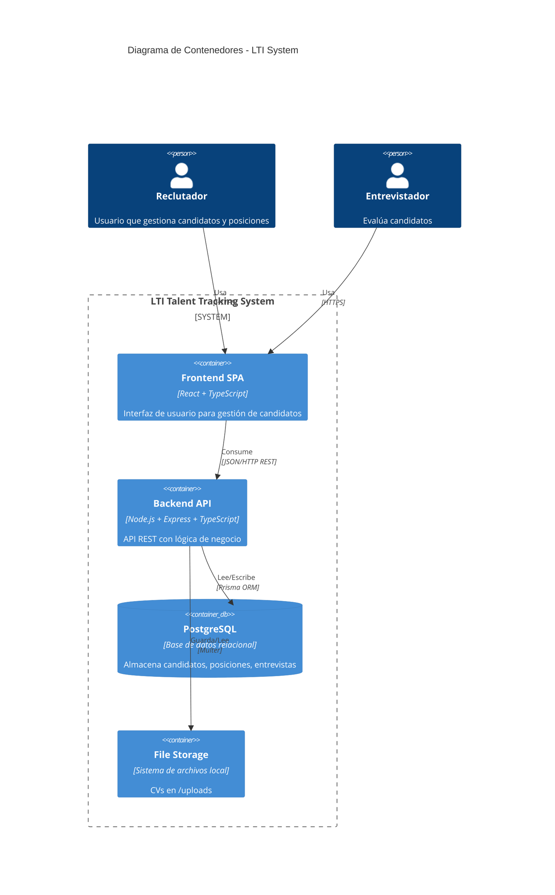
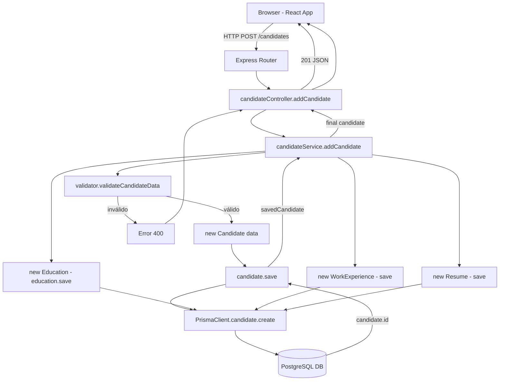

# System Patterns - LTI Talent Tracking System

## Arquitectura general

### Tipo: Full-stack monorepo (separación frontend/backend)

```
AI4Devs-qa-202510/
├── backend/          → API REST (Node.js + Express + TypeScript)
├── frontend/         → SPA (React + TypeScript)
├── docker-compose.yml → Orquestación PostgreSQL
└── memory-bank/      → Documentación (este directorio)
```

**No es monorepo real**: Dos proyectos separados con package.json independientes, sin workspace compartido.

### Estilo arquitectónico

**Backend**: **Domain-Driven Design (DDD) - Layered Architecture**

```
backend/src/
├── domain/          → Entidades y lógica de negocio
│   └── models/      → 12 modelos de dominio (Candidate, Position, etc.)
├── application/     → Lógica de aplicación y orquestación
│   ├── services/    → Servicios de negocio (candidateService, positionService)
│   └── validator.ts → Validación de inputs
├── presentation/    → Capa de presentación
│   └── controllers/ → Controladores HTTP
├── routes/          → Definición de rutas Express
└── index.ts         → Entrypoint y configuración Express
```

**Nota crítica**: La separación de capas no es estricta. Los modelos de dominio (`domain/models/`) contienen lógica de persistencia (llamadas directas a Prisma), violando DDD puro y el principio de inversión de dependencias (DIP).

**Frontend**: **Component-based architecture (React)**

```
frontend/src/
├── components/      → Componentes React (8 componentes)
│   ├── AddCandidateForm.js
│   ├── CandidateDetails.js
│   ├── Positions.tsx
│   └── ...
├── services/        → Llamadas a API (candidateService.js)
├── config/          → Configuración (api.ts con URLs)
└── App.js           → Componente raíz y routing
```

**Pattern**: Componentes funcionales + hooks (React moderno), pero sin state management global (Redux/Context no detectado).

## Patrones de diseño detectados

### 1. Active Record (Anti-pattern según DDD estricto)

**Dónde**: `backend/src/domain/models/*.ts`

**Ejemplo**: `Candidate.ts`
```typescript
export class Candidate {
    id?: number;
    firstName: string;
    // ... properties
    
    async save() {
        // Lógica de persistencia directa con Prisma
        return await prisma.candidate.create({data: candidateData});
    }
    
    static async findOne(id: number) {
        return await prisma.candidate.findUnique({where: {id}});
    }
}
```

**Por qué es anti-pattern aquí**: 
- Mezcla lógica de dominio con infraestructura
- Dependencia directa de PrismaClient
- Dificulta testing (mock de BD)
- Viola Single Responsibility Principle

**Alternativa sugerida**: Repository Pattern (no implementado completamente)

### 2. Service Layer

**Dónde**: `backend/src/application/services/`

**Ejemplo**: `candidateService.ts`
```typescript
export const addCandidate = async (candidateData: any) => {
    validateCandidateData(candidateData);
    const candidate = new Candidate(candidateData);
    const savedCandidate = await candidate.save();
    // Guardar educations, workExperiences, resumes...
    return savedCandidate;
};
```

**Propósito**: Orquestación de lógica de negocio compleja (transacciones multi-entidad).

**Limitación**: Services no usan repositorios abstraídos, llaman directamente a modelos.

### 3. DTO (Data Transfer Object) implícito

**Dónde**: Request/Response en controllers

**Ejemplo**: El cuerpo de POST `/candidates` actúa como DTO, aunque no hay clases explícitas.

**Validación**: `backend/src/application/validator.ts` valida estructura antes de pasar a dominio.

### 4. Dependency Injection (parcial)

**Dónde**: `backend/src/index.ts`

```typescript
app.use((req, res, next) => {
  req.prisma = prisma;  // Inyección de PrismaClient en request
  next();
});
```

**Limitación**: Solo se usa en middleware, no en constructores de clases (DI manual, no framework).

### 5. Factory Pattern (ausente, debería estar)

**Problema**: Creación de objetos complejos (Candidate + Education + WorkExperience) se hace manualmente en services.

**Recomendación del proyecto**: El archivo `ManifestoBuenasPracticas.md` sugiere implementar Factories.

### 6. Aggregate Pattern (DDD)

**Dónde**: `Candidate` como aggregate root

**Relaciones**:
```
Candidate (root)
├── Education[]
├── WorkExperience[]
├── Resume[]
└── Application[]
```

**Correcto**: Las operaciones sobre Education/WorkExperience pasan por Candidate.

**Limitación**: No hay validación de invariantes de agregado (ej. candidato debe tener al menos una educación).

## Convenciones de carpetas y naming

### Backend

#### Estructura de archivos
- **Modelos**: `backend/src/domain/models/<Entity>.ts` (PascalCase singular)
  - Ejemplo: `Candidate.ts`, `WorkExperience.ts`
- **Servicios**: `backend/src/application/services/<entity>Service.ts` (camelCase + Service)
  - Ejemplo: `candidateService.ts`, `positionService.ts`
- **Controllers**: `backend/src/presentation/controllers/<entity>Controller.ts`
  - Ejemplo: `candidateController.ts`
- **Routes**: `backend/src/routes/<entity>Routes.ts`
  - Ejemplo: `candidateRoutes.ts`

#### Naming de funciones
- **Services**: Verbos descriptivos en camelCase
  - `addCandidate()`, `findCandidateById()`, `updateCandidateStage()`
- **Controllers**: Igual que services o con sufijo Controller
  - `getCandidateById()`, `updateCandidateStageController()`
- **Métodos de modelo**: 
  - Instance: `save()`, `update()`
  - Static: `findOne()`, `findAll()`

#### Prisma Schema
- Modelos en PascalCase singular: `model Candidate`
- Campos en camelCase: `firstName`, `currentInterviewStep`
- Relaciones plurales: `educations`, `workExperiences`

### Frontend

#### Estructura de archivos
- **Componentes**: `frontend/src/components/<ComponentName>.js|.tsx` (PascalCase)
  - Ejemplo: `AddCandidateForm.js`, `CandidateDetails.js`
- **Services**: `frontend/src/services/<entity>Service.js`
  - Ejemplo: `candidateService.js`
- **Config**: `frontend/src/config/<name>.ts`

#### Naming de componentes
- Descriptivos y específicos: `AddCandidateForm` no `Form`
- Sufijos comunes: `Form`, `Details`, `Card`, `Dashboard`

#### Naming de funciones de servicio
- `getCandidate(id)`, `addCandidate(data)`, `updateCandidateStage(id, data)`

## Relaciones entre componentes

### Diagrama de arquitectura C4 - Nivel 2 (Container)



### Diagrama de flujo de datos



### Dependencias clave entre módulos

**Backend**:
```
index.ts (entrypoint)
    ├─→ routes/candidateRoutes.ts
    │       └─→ controllers/candidateController.ts
    │               └─→ services/candidateService.ts
    │                       ├─→ validator.ts
    │                       └─→ models/Candidate.ts
    │                               └─→ @prisma/client
    │
    ├─→ routes/positionRoutes.ts
    │       └─→ controllers/positionController.ts
    │               └─→ services/positionService.ts
    │                       └─→ models/Position.ts
    │
    └─→ services/fileUploadService.ts
            └─→ multer
```

**Frontend**:
```
index.tsx
    └─→ App.js
            ├─→ components/RecruiterDashboard.js
            │       └─→ components/Positions.tsx
            │               └─→ components/PositionDetails.js
            │                       ├─→ components/StageColumn.js
            │                       │       └─→ components/CandidateCard.js
            │                       │               └─→ components/CandidateDetails.js
            │                       └─→ services/candidateService.js
            │                               └─→ config/api.ts
            │
            └─→ components/AddCandidateForm.js
                    ├─→ components/FileUploader.js
                    └─→ services/candidateService.js
```

## Patrones de comunicación

### Backend → Database
- **Pattern**: ORM (Prisma)
- **Connection**: Pool gestionado por Prisma (config en DATABASE_URL)
- **Queries**: Prisma Client con TypeScript types generados
- **Transacciones**: NO implementadas explícitamente (riesgo de inconsistencia)

### Frontend → Backend
- **Pattern**: REST API calls con fetch nativo
- **Base URL**: Configurable en `frontend/src/config/api.ts`
- **Auth**: NO implementado (sin headers de autorización)
- **Error handling**: Try-catch en services, pero UI handling UNKNOWN
- **State**: Local component state (useState), no state global

### File uploads
- **Pattern**: Multipart form-data
- **Library**: Multer (backend)
- **Storage**: Local filesystem en `backend/uploads/`
- **Flow**: Frontend → POST /upload → Guardar archivo → Retornar path → Frontend → POST /candidates con path

## Limitaciones de arquitectura actual

### 1. Sin capa de repositorio real
**Problema**: Modelos llaman directamente a Prisma  
**Impacto**: Dificulta testing unitario, acoplamiento a implementación de BD  
**Sugerencia**: Implementar interfaces de repositorio + inyección de dependencias

### 2. Sin transacciones explícitas
**Problema**: Crear candidato + education + workExperience no es atómico  
**Impacto**: Riesgo de datos inconsistentes si falla a mitad  
**Sugerencia**: Usar `prisma.$transaction()`

### 3. Modelos anémicos y ricos mezclados
**Problema**: Algunos modelos solo tienen datos, otros tienen lógica  
**Impacto**: Inconsistencia, dificulta entender dónde va lógica  
**Ejemplo**: `Candidate` tiene `save()`, pero `Education` también (deberían ir en repositories)

### 4. Sin event sourcing ni domain events
**Problema**: Cambios de estado no generan eventos  
**Impacto**: No se pueden desencadenar side-effects (notificaciones, auditoría)  
**Sugerido en**: `ManifestoBuenasPracticas.md` menciona eventos de dominio

### 5. Frontend sin state management
**Problema**: Estado distribuido en componentes locales  
**Impacto**: Dificulta sincronización, puede haber datos stale  
**Ejemplo**: Cambiar etapa de candidato no actualiza lista de posiciones automáticamente

### 6. Sin API Gateway / BFF
**Problema**: Frontend llama directamente a endpoints de backend  
**Impacto**: Múltiples requests para vista compuesta (N+1 potencial)  
**Ejemplo**: Cargar PositionDetails probablemente hace múltiples llamadas

## Convenciones de código

### TypeScript
- Strict mode habilitado en `tsconfig.json`
- Interfaces implícitas (uso de `any` frecuente, no ideal)
- No se usan enums para estados (strings literales)

### Error handling
- Try-catch en controllers y services
- Errores de Prisma capturados por código (ej. `P2002` = unique constraint)
- Errores HTTP con status codes: 400 (bad request), 404 (not found), 500 (server error)

### Validación
- Backend: `validator.ts` con regex para emails, nombres, teléfonos
- Frontend: Validación básica en forms (HTML5 + React)
- No se usa librería de validación (Zod, Yup, Joi)

### Testing
- Framework: Jest + ts-jest
- Convención: `<module>.test.ts` junto a archivo fuente
- Cobertura: PARCIAL (solo candidateService y positionService tienen tests)

## Preguntas al humano sobre arquitectura

1. ¿Se planea migrar a arquitectura de microservicios?
2. ¿Hay planes de implementar CQRS (separar reads/writes)?
3. ¿Se necesita soporte para background jobs (procesamiento async de CVs)?
4. ¿Qué estrategia de caching se contempla?
5. ¿Se va a implementar API versioning (v1, v2)?
6. ¿Hay requisitos de multi-tenancy?
